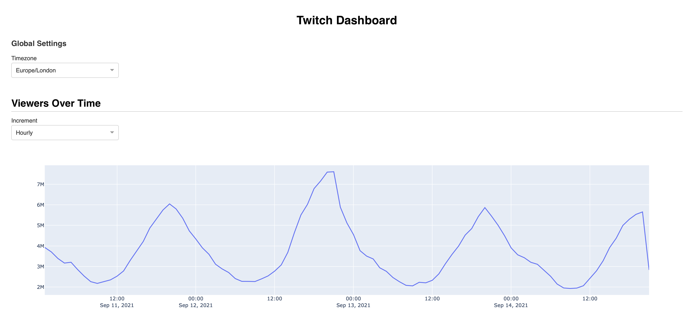
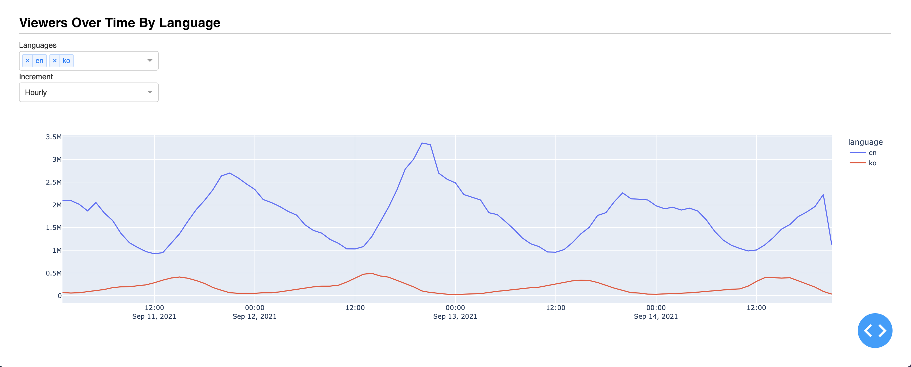
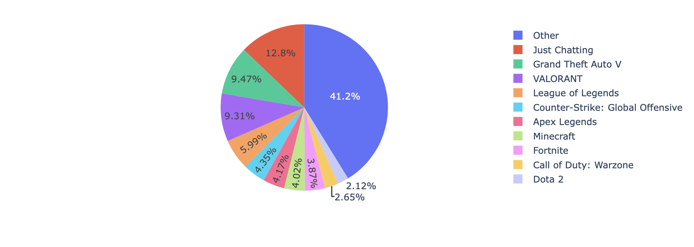
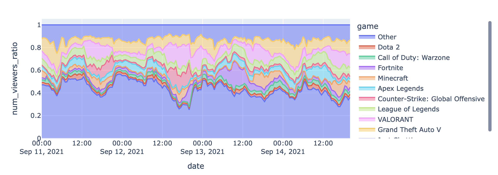

### MVP:

The focus of the project was to explore whether a dashboard for twitch stats could be created.

The following steps have been completed so far:

- Create a pipeline for fetching Twitch API requests and storing it on a mongo atlas database.
- EDA/Graphing the data.
- Implementing a Dash App

Current Dash App:

Future Graphs to implement:

Pie Chart

Stacked Area Chart

